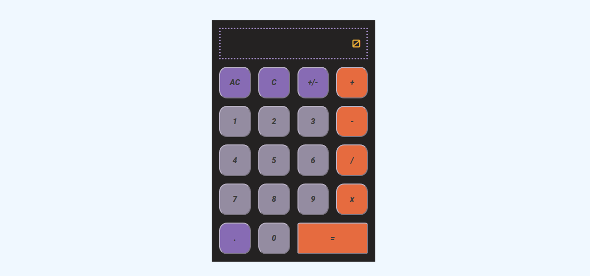

# Calculator

The final project on the Foundations curriculum at [The Odin Project](https://www.theodinproject.com), a calculator that implements the four basic arithmetic operations. The intermediate result is shown after each operation. The clou here is using variables that store the temporary result and the currently selected operator.

## Reflection

- Some more thinking and planning before starting to code could have saved me much time. The logic/problem-solving in this project was far more challenging for me than the actual implementation.
- Adding new functionality and fixing bugs tended to mess around with the code, making functions bigger and complicating the logic of the whole thing.
- I also encountered some situations in which I was not sure how something should work. The "C"- and "+/-"-buttons especially gave me headaches. Should I allow the user to alter the number he has already entered after he clicked an operator-button? I tried that solution out but found it to be unintuitive (at least without a dedicated output-field that shows the whole calculation so far). Finally I settled with probably the easiest way out: disabling these buttons after an operator was clicked
- On the high side, the CSS felt a lot easier than during the first few projects and I am quite pleased with the looks of the calculator.

## Demo

[View it here](https://reinimax.github.io/calculator/) (hint: try dividing by zero :wink:)
